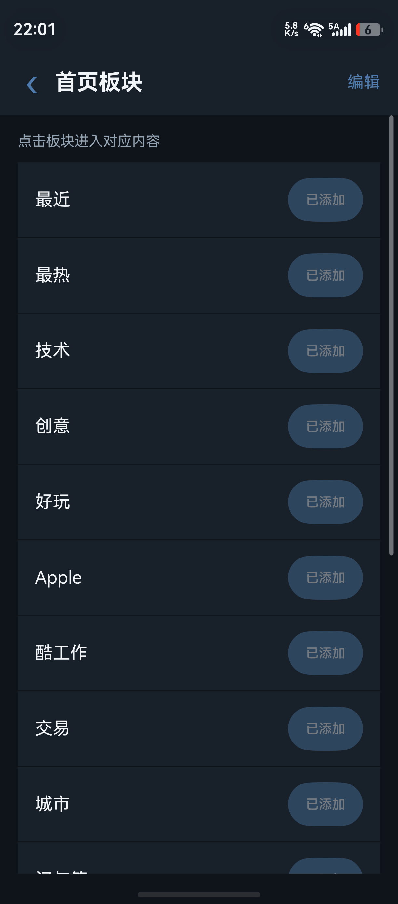
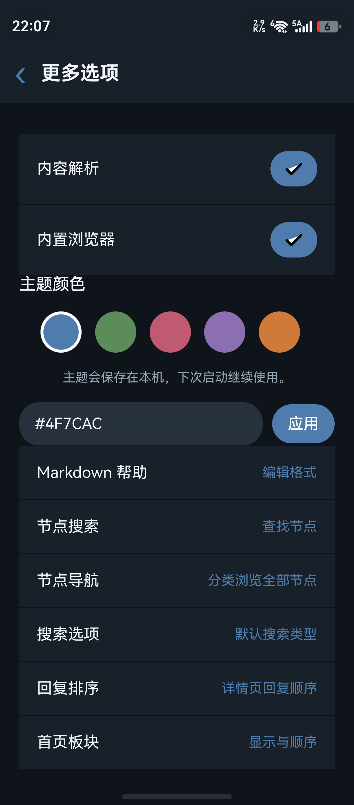

# V2Halo

V2Halo 是 V2EX 的 HarmonyOS 原生客户端，使用 ArkTS、ArkUI 和 DevEco CLI 构建。

## 应用展示

<p>
  
  
  
  
</p>

截图来自 HarmonyOS 真机，图片存放在仓库内，便于直接预览和引用

## 当前状态

当前为原生 ArkUI 客户端，提供首页、最近、最热、XNA、节点和个人中心信息架构，已接入 V2EX 公开 API 及网页端登录 Cookie。

已实现的原生流程包括：

- 最近/最热/XNA/节点/我的 Tab、下拉刷新、横向切换和节点分页；
- 主题和用户搜索、主题详情、Markdown 图片、回复、回复编辑、追加内容、回复排序；
- 关联回复筛选、主题忽略/举报、用户屏蔽、通知删除、Imgur 图片上传（系统相册选择后自动插入 Markdown）和可配置 V2EX 域名；
- 收藏、感谢、赞/踩、回复感谢、作者资料（主题/回复 Tab）和关注；
- 原生登录（验证码手工输入，支持两步验证）、发布/编辑主题、预览、通知、我的主题、我的节点、主题收藏、特别关注、最近浏览、历史热议；
- 主题颜色、内容解析/内置浏览器开关、主题屏蔽规则、社区排行、反馈 WebView 和退出登录。
- 主题外观自定义、Markdown 编辑帮助、节点搜索、搜索类型选项、回复对象搜索和回复排序设置均为独立原生页面，并从设置入口可达。
- 主题设置支持自定义颜色和可持久化深色模式；首页、详情、个人中心、设置和侧边菜单会同步主题表面与文字颜色。
- 应用桌面图标和启动图使用参考客户端风格的 V 标识矢量资源，Bundle 为 `io.github.qinlinglong.v2ex`。
- 节点导航和屏蔽列表已补齐为独立原生页面；屏蔽用户操作使用 V2EX 会员 ID 请求，并在本地同步屏蔽/忽略状态。
- 首页已加入可收起的原生侧边菜单；节点收藏状态、屏蔽列表清空、自动签到均与网页端状态同步。
- 详情页回复统一平铺展示；支持原生选择回复对象，可按用户名或回复内容筛选并将多个 `@用户名` 回填到回复框。
- 系统状态栏采用浅色原生系统栏样式，搜索输入框提供明确的占位与正文文字颜色。
- 首页板块支持本地持久化的显示/隐藏和上下移动，可启用参考客户端中的技术、创意、好玩、Apple、酷工作、交易、城市、问与答、全部等节点板块；节点板块使用 V2EX 节点主题接口加载。

登录页和已覆盖的内容页、操作页均使用原生 ArkUI；登录会话同时保存 native Cookie 和 ArkWeb Cookie，退出登录时会清理两者。

## 构建

需要 HarmonyOS API 24+ SDK 和 `devecocli`：

```bash
devecocli build --modules entry@default --product default --build-mode debug
```

构建产物位于 `entry/build/default/outputs/default/`。

连接真机后可使用：

```bash
devecocli signature generate --product default
devecocli build --modules entry@default --product default --build-mode debug
devecocli run --module entry@default --device <device-serial> --product default --build-mode debug --skip-build
```

`signature generate` 会写入本机签名配置，仅用于本地安装测试；不要将生成的证书、私钥或签名密码提交到仓库。

## 项目标识

- Bundle：`io.github.qinlinglong.v2ex`
- 初始版本：`1.0.0`
- 项目目录：`v2ex-harmonyos`

## 真机验证

已使用 DevEco CLI 在 HarmonyOS 6.1.1(24) 真机上验证首页 Tab、网络失败后的个人中心切换、节点列表/分页、主题详情、回复编辑入口、搜索、主题设置、主题屏蔽和社区排行页面。`devecocli check lint` 无缺陷；构建输出中的 ArkTS `pushUrl/back/getParams` 为 API 弃用提示，不影响当前构建。
